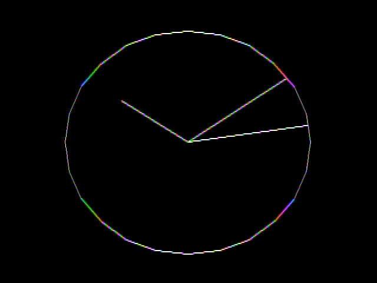
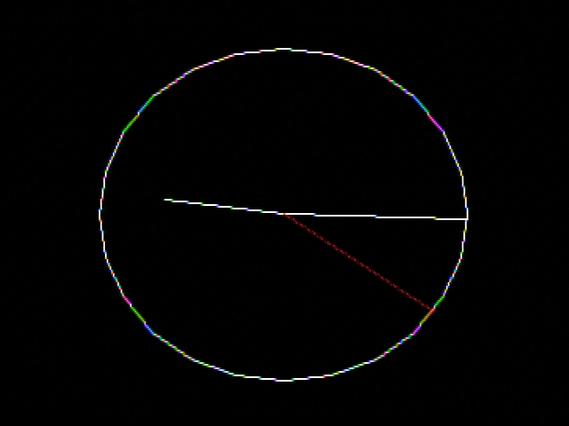
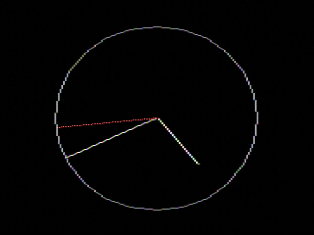

# Clock

An analog clock display, as a demonstration of TGI and clock implementations.

## Building

To choose a TGI driver (and therefore graphics mode), set the MODE variable when
building:

* `_1BPP`: 640x192 monochrome
* `_4BPP`: 320x192 16-color
* `_8BPP`: 160x192 256-color
